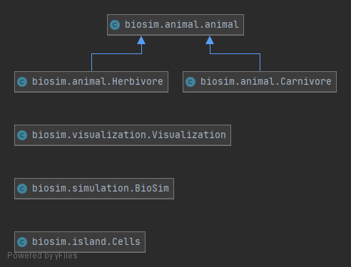

.. Simulation of island documentation master file, created by
   sphinx-quickstart on Sun Jan 10 19:41:12 2021.
   You can adapt this file completely to your liking, but it should at least
   contain the root `toctree` directive.

Welcome to Simulation of island's documentation!
================================================
In this document I'm going to teach you what tok us 3 weeks.

Table of Content
=================

.. toctree::
   :maxdepth: 2
   :caption: Contents:

   simulation
   logic
   island
   visuals
   animal
   visualization
   User handel <README>

Theory
======
To simulate an animal population we need to recreate its behavore. This is done through ``seasons`` where each season interacts with the island. The primary ones are 

* feeding
* birth
* migration
* age
* The end

``The end`` could not count as a season since its effect on the island is just refilling cells and counting population.

The heriacy is as follows

Every singel class in the heriacy gets used in the simulation along with its components. To add more we need to append to ``animal.py``

Indices and tables
==================

* :ref:`genindex`
* :ref:`modindex`
* :ref:`search`